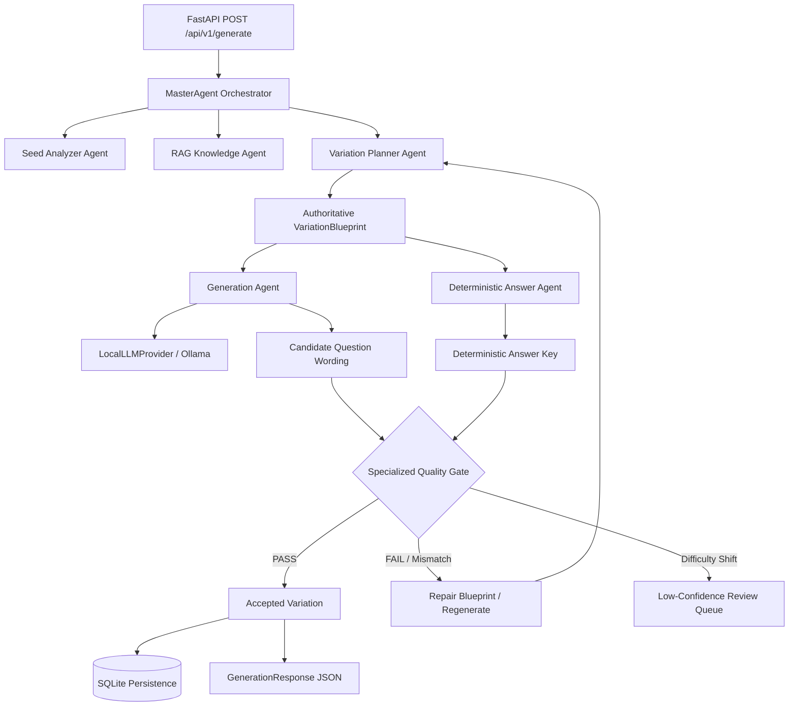

# AMIGO — Assignment Question Iteration & Variation Generation System

**AMIGO** is an agentic, production-ready backend system developed for the **AMYPO National Hackathon 2026 Problem Statement 8 (PS8)**: *"Assignment Question Iteration & Variation Generation System"*.

The primary goal of AMIGO is to generate high-quality, pedagogically equivalent assignment question variations from a seed question while preserving learning objectives, cognitive Bloom levels, and mathematical formulas, accompanied by 100% deterministically computed answer keys.

---

## 🔑 Key Features

- **Agentic Orchestration**: Managed by `MasterAgent` coordinating seed analysis, RAG context retrieval, blueprint planning, wording generation, deterministic answer solving, and multi-evaluator quality gates.
- **Authoritative Blueprint Planning**: `VariationPlanner` enforces rigid mathematical and pedagogical blueprints, preventing LLM math hallucinations.
- **Deterministic Answer Key Generation**: Solves numerical answers and step-by-step solutions programmatically from blueprint variables without prompting LLMs.
- **Batch Local LLM Provider**: Integrates open-weight local LLMs (`qwen3:4b` via Ollama) with a single-HTTP-request batch generation interface (`generate_text_batch`).
- **Multi-Layer Quality Evaluation**: Evaluates learning objective preservation, Bloom cognitive depth, structural difficulty equivalence, vector duplicate detection, and exact blueprint parameter consistency.
- **Smart Targeted Regeneration**: Automatically repairs failed blueprints based on specific validator feedback up to `MAX_REGENERATION_ATTEMPTS`.
- **Zero Paid API Dependencies**: Operates 100% locally with open-weight models and local vector indexing.

---

## 🏛️ System Architecture & Workflow



*For complete architectural specifications, see [`docs/architecture.md`](docs/architecture.md).*

---

## 📁 Repository Structure & Module Responsibilities

```
amigo/
├── apps/
│   ├── api/          # FastAPI REST endpoints, SQLite database models, repository pattern
│   ├── generator/    # Seed parser, objective analyzer, variation planner, variation generator, solver
│   ├── evaluator/    # Difficulty analyzer, equivalence validator, duplicate detector, quality gate
│   └── orchestrator/ # MasterAgent orchestrator & workflow logging
├── packages/
│   ├── schemas/      # Pydantic data contracts (SeedQuestion, GenerationRequest, etc.)
│   └── common/       # Config, exceptions, RAG provider, and LLM/Embedding/VectorStore interfaces
├── tests/            # Pytest test suite (50 tests covering API, generator, evaluator, agentic flow)
├── docs/             # Technical documentation (architecture.md, AMIGO_TECHNICAL_DOCUMENTATION.md)
├── models/           # Open-weight local model specifications (models/README.md)
└── data/             # Database (amigo.db), golden seed data, fine-tuning logs (data/README.md)
```

### Module Breakdown
- **`apps/api`**: Exposes HTTP endpoints (`/generate`, `/domains`, `/health`), manages SQLite database tables (`GenerationRunDB`, `QuestionVariationDB`, `ReviewItemDB`), and enforces repository persistence.
- **`apps/generator`**: Pure computational package for parsing seed questions, planning variation blueprints, calling local LLM batch generation, and executing deterministic answer solvers.
- **`apps/evaluator`**: Independent testing suite containing Bloom classifiers, difficulty analyzers, vector duplicate detectors, answer validators, and `SpecializedQualityGate`.
- **`apps/orchestrator`**: Master controller (`MasterAgent`) coordinating agent flow, executing targeted regeneration retries, logging telemetry, and logging fine-tuning trajectories.
- **`packages/common/providers`**: Provider interfaces (`LLMProvider`, `LocalLLMProvider`, `MockLLMProvider`, `EmbeddingProvider`, `VectorStore`) preventing framework lock-in.

---

## 🛠️ Technology Stack

- **Language**: Python 3.10+ (Tested on Python 3.12)
- **Web Framework**: FastAPI & Uvicorn
- **Data Validation**: Pydantic v2
- **Database & ORM**: SQLite & SQLAlchemy
- **Model Runtime**: Ollama (serving open-weight `qwen3:4b` locally)
- **Testing**: Pytest & FastAPI TestClient
- **HTTP Client**: HTTPX

---

## ⚡ Quick Start & Installation

### 1. Prerequisites
- Python 3.10 or higher installed.
- [Ollama](https://ollama.com/) installed (for running local open-weight LLMs).

### 2. Clone and Setup Environment
```bash
# Clone the repository
git clone https://github.com/sabarieshwaran1102-debug/Assignment-Question-Iteration-Variation-Generation-System.git
cd Assignment-Question-Iteration-Variation-Generation-System

# Create and activate Python virtual environment
python -m venv venv
# On Windows PowerShell:
.\venv\Scripts\Activate.ps1
# On Linux/macOS:
source venv/bin/activate

# Install AMIGO in editable mode
pip install -e .
```

### 3. Pull and Start Local Model (Ollama)
```bash
# Pull the recommended open-weight local model
ollama pull qwen3:4b

# Verify Ollama service is running on http://localhost:11434
curl http://localhost:11434/api/tags
```

### 4. Configure Environment Variables
Set the environment variables to use the local model provider:

**Windows PowerShell:**
```powershell
$env:AMIGO_LLM_PROVIDER="local"
$env:AMIGO_LOCAL_MODEL="qwen3:4b"
$env:AMIGO_LOCAL_BASE_URL="http://localhost:11434"
```

**Linux/macOS Bash:**
```bash
export AMIGO_LLM_PROVIDER="local"
export AMIGO_LOCAL_MODEL="qwen3:4b"
export AMIGO_LOCAL_BASE_URL="http://localhost:11434"
```

*(If `AMIGO_LLM_PROVIDER` is not set, AMIGO defaults to the offline `mock` provider).*

### 5. Start the AMIGO API Server
```bash
python -m uvicorn apps.api.main:app --host 0.0.0.0 --port 8000 --reload
```
The server will run at `http://localhost:8000`. Interactive OpenAPI documentation is available at `http://localhost:8000/docs`.

---

## 🧪 Running Automated Tests

Run the full pytest suite:

```bash
python -m pytest -q
```

**Latest Test Result**: `50 passed, 0 failed` in ~28 seconds.

---

## 📡 API Endpoints & Usage Examples

### 1. Health Check (`GET /api/v1/health`)
```bash
curl -X GET "http://localhost:8000/api/v1/health"
```
**Response:**
```json
{
  "status": "healthy",
  "phase": "Phase 1 - Backend Foundation & Shared Contracts",
  "version": "1.0.0"
}
```

### 2. Selectable Subject Domains (`GET /api/v1/domains`)
```bash
curl -X GET "http://localhost:8000/api/v1/domains"
```
**Response:**
```json
{
  "domains": [
    { "id": "cs", "name": "Computer Science", "description": "Algorithms, data structures, software architecture, systems" },
    { "id": "physics", "name": "Physics", "description": "Classical mechanics, electromagnetism, thermodynamics, quantum mechanics" },
    { "id": "math", "name": "Mathematics", "description": "Calculus, linear algebra, probability, differential equations" },
    { "id": "ee", "name": "Electrical Engineering", "description": "Circuit analysis, signal processing, digital logic, power systems" },
    { "id": "chem", "name": "Chemistry", "description": "Physical chemistry, stoichiometry, thermodynamics, reaction kinetics" }
  ]
}
```

### 3. Generate Variations (`POST /api/v1/generate`)

#### Single Variation Request (`count=1`)
```bash
curl -X POST "http://localhost:8000/api/v1/generate" \
     -H "Content-Type: application/json" \
     -d '{
           "seed_question": "A car travels a distance of 150 meters in 5 seconds. What is the velocity of the car?",
           "domain": "physics",
           "count": 1,
           "target_difficulty": 0.5
         }'
```
**Response:**
```json
{
  "variations": [
    {
      "question": "A cyclist travels 240 meters in 12 seconds. Calculate the velocity of the cyclist.",
      "answer_key": "20 m/s\nExplanation: Step 1: Identify given variables for the cyclist: distance d = 240.0 m, time t = 12.0 s. Step 2: Apply the velocity formula v = d / t. Step 3: Calculate velocity = 240.0 / 12.0 = 20 m/s.",
      "difficulty": 0.5
    }
  ],
  "duplicate_rate": 0.0
}
```

#### Batch Variation Request (`count=10`)
```powershell
Invoke-RestMethod -Uri "http://localhost:8000/api/v1/generate" -Method Post -ContentType "application/json" -Body '{
  "seed_question": "A car travels a distance of 150 meters in 5 seconds. What is the velocity of the car?",
  "domain": "physics",
  "count": 10
}'
```

---

## 📊 Current MVP Status & Limitations

### Status Matrix

| Component | Status | Notes |
| :--- | :--- | :--- |
| **MasterAgent Control** | **IMPLEMENTED** | Orchestrates entire generation & evaluation flow. |
| **API → MasterAgent Routing** | **IMPLEMENTED** | `POST /api/v1/generate` routes directly to `MasterAgent`. |
| **Authoritative Planning** | **IMPLEMENTED** | Locks numerical variables & formulas via `VariationBlueprint`. |
| **Local LLM Batching** | **IMPLEMENTED** | Uses single-request `generate_text_batch` via `LocalLLMProvider`. |
| **Deterministic Answer Keys** | **IMPLEMENTED** | Calculated programmatically from blueprint variables. |
| **Multi-Layer Evaluation** | **IMPLEMENTED** | Objective, Bloom, difficulty, duplicate, and blueprint consistency validators. |
| **Targeted Regeneration** | **IMPLEMENTED** | Repairs blueprints on failure up to `MAX_REGENERATION_ATTEMPTS`. |
| **Bulk CSV/JSON Export** | **PARTIAL** | Export functions exist in `MasterAgent`, CLI/UI export pending. |
| **Review Queue UI** | **PARTIAL** | `ReviewItemDB` tables and backend objects implemented; Web UI pending. |
| **Inference Acceleration** | **PLANNED** | GPU acceleration & vLLM provider integration planned for production phase. |

---

## 🗺️ Development Roadmap

- **Phase 1 (Completed)**: Core domain contracts, API endpoints, schema definitions, mock providers, and basic test suite.
- **Phase 2 (Completed)**: Local LLM provider integration (`LocalLLMProvider`), Ollama support, deterministic solver integration, and evaluator quality gates.
- **Phase 3 (Completed / Current MVP)**: MasterAgent agentic architecture integration, batch provider optimization (`generate_text_batch`), anti-hallucination blueprint consistency validation, fine-tuning trajectory logging, and full test suite verification (50 passing tests).
- **Phase 4 (Future / Production)**:
  - Bulk CSV/JSON export endpoints.
  - Web UI for low-confidence instructor review.
  - Multi-domain formula solver expansion (Chemistry, EE, Mathematics).
  - GPU inference serving (vLLM / TensorRT-LLM).

---

## 📚 Complete Technical Documentation

- 📄 [`docs/architecture.md`](docs/architecture.md): Deep-dive system architecture, Mermaid diagrams, component breakdown, and directory inventory.
- 📄 [`docs/AMIGO_TECHNICAL_DOCUMENTATION.md`](docs/AMIGO_TECHNICAL_DOCUMENTATION.md): Complete technical reference guide detailing every module, file, agent, API contract, database model, and developer guide.
- 📄 [`models/README.md`](models/README.md): Specifications and setup for local open-weight LLMs (`qwen3:4b` / Ollama).
- 📄 [`data/README.md`](data/README.md): Information on database schemas (`amigo.db`), golden benchmark datasets, and fine-tuning trajectory logs (`fine_tuning_dataset.jsonl`).
