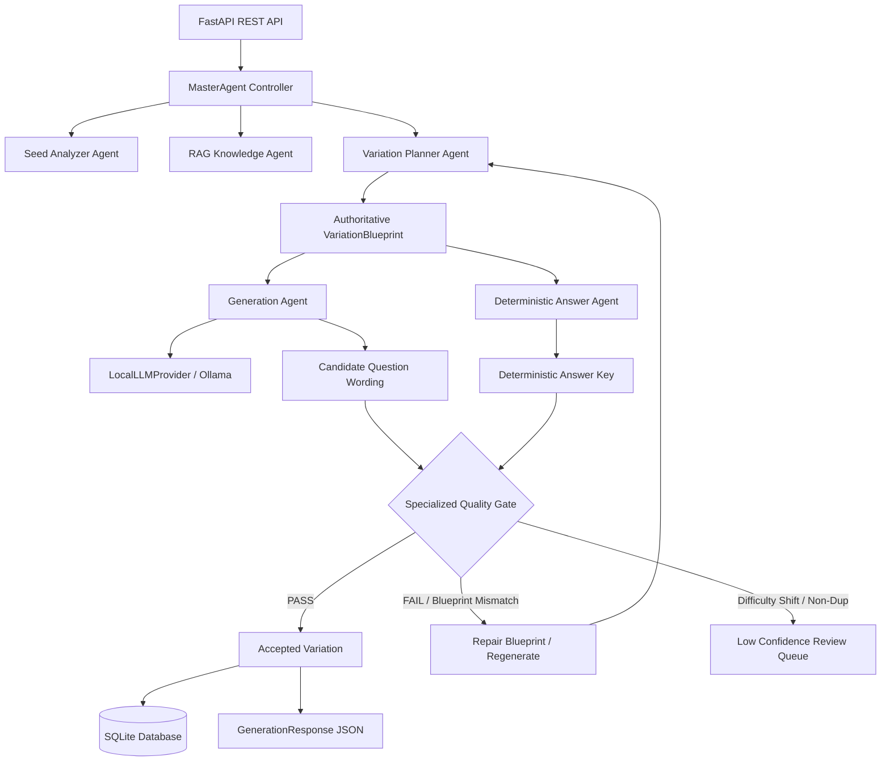

# AMIGO Complete Technical Documentation

---

## 1. Introduction & Overview

**AMIGO** (*Assignment Question Iteration & Variation Generation System*) is an enterprise-grade, agentic backend platform designed for the **AMYPO National Hackathon 2026 Problem Statement 8 (PS8)**.

The system addresses the challenge of creating high-quality, pedagogically equivalent question variations from a seed assignment question. It preserves core learning objectives, cognitive Bloom levels, and mathematical formulas while systematically altering real-world surface contexts, numerical parameters, and wording. Every variation is generated alongside a 100% accurate, deterministically calculated answer key.

---

## 2. Problem Statement Context (PS8)

In academic and automated evaluation systems, generating question variations manually is time-consuming and prone to mathematical or conceptual errors. Problem Statement 8 requires an automated system capable of:

1. Accepting a **seed question**, **user-selected domain**, and **requested variation count \(N\)**.
2. Generating variations while preserving learning objectives and difficulty.
3. Changing surface context and underlying numbers/methodology appropriately.
4. Programmatically creating accurate step-by-step answer keys for every variation.
5. Evaluating candidate variations for cognitive Bloom level, difficulty equivalence, vector near-duplication, and formula consistency.
6. Operating completely offline / locally with open-weight models without reliance on paid cloud LLM APIs.

---

## 3. System Architecture & Design Goals

### Architectural Principles
1. **Separation of Wording Generation and Answer Key Solving**: Wording is generated by a local LLM guided by an authoritative blueprint; numerical answers are calculated deterministically by programmatic solvers.
2. **Authoritative Blueprint Lock**: The `VariationPlanner` constructs a rigid `VariationBlueprint` containing known variables, formulas, and target concepts. The LLM is constrained to wording conversion only.
3. **Decoupled Module Boundaries**: `apps/api` owns HTTP contracts and database persistence; `apps/generator` is a pure computational generator; `apps/evaluator` is an independent quality evaluator; `apps/orchestrator` coordinates agent state transitions.
4. **Provider Abstraction**: Model interaction is isolated behind `LLMProvider`, `EmbeddingProvider`, and `VectorStore` interfaces.



---

## 4. Complete Repository Directory Inventory

```
amigo/
├── apps/
│   ├── api/
│   │   ├── __init__.py          # API package initialization
│   │   ├── database.py          # SQLite engine and session factory
│   │   ├── dependencies.py      # FastAPI dependency injection container
│   │   ├── main.py              # FastAPI application bootstrap
│   │   ├── models.py            # SQLAlchemy database tables
│   │   ├── repository.py        # GenerationRepository implementation
│   │   └── routes.py            # REST API endpoints (/generate, /domains, /health)
│   ├── evaluator/
│   │   ├── __init__.py          # Evaluator package initialization
│   │   ├── answer_validator.py  # Answer key validation
│   │   ├── bloom.py             # Bloom taxonomy classification & evaluation
│   │   ├── blueprint_validator.py # Blueprint consistency & anti-hallucination validation
│   │   ├── difficulty.py        # Structural difficulty scoring & equivalence check
│   │   ├── duplicate.py         # Embedding-based vector duplicate detection
│   │   ├── evaluate_golden.py   # Golden dataset evaluation script
│   │   ├── evaluator.py         # Base aggregator VariationEvaluator
│   │   ├── interfaces.py        # Evaluator abstract interfaces
│   │   ├── objective_validator.py # Learning objective consistency validator
│   │   └── specialized.py       # SpecializedQualityGate aggregator
│   ├── generator/
│   │   ├── __init__.py          # Generator package initialization
│   │   ├── answer.py            # AnswerKeyGenerator implementation
│   │   ├── blueprint.py         # DefaultBlueprintGenerator & physics scenarios
│   │   ├── interfaces.py        # Generator abstract interfaces
│   │   ├── objective.py         # LearningObjectiveAnalyzer implementation
│   │   ├── parser.py            # QuestionParser implementation
│   │   ├── planner.py           # DefaultVariationPlanner & repair_blueprint
│   │   ├── seed_analyzer.py     # DefaultSeedAnalyzer implementation
│   │   ├── solver.py            # Deterministic DefaultAnswerSolver
│   │   └── variation.py         # DefaultVariationGenerator (batch LLM integration)
│   └── orchestrator/
│       ├── __init__.py          # Orchestrator package initialization
│       ├── agent.py             # MasterAgent implementation & telemetry
│       ├── interfaces.py        # OrchestratorInterface abstract base
│       └── pipeline.py          # Legacy GenerationOrchestrator wrapper
├── packages/
│   ├── common/
│   │   ├── __init__.py          # Common package initialization
│   │   ├── config.py            # Pydantic system configuration & env vars
│   │   ├── exceptions.py        # AMIGO custom exception hierarchy
│   │   ├── rag.py               # Local RAG & KnowledgeContextProvider
│   │   └── providers/
│   │       ├── __init__.py      # Providers package initialization
│   │       ├── interfaces.py    # LLMProvider, EmbeddingProvider, VectorStore interfaces
│   │       ├── local_provider.py # LocalLLMProvider (Ollama HTTP batch client)
│   │       └── mock_provider.py # Deterministic MockLLMProvider & MockEmbeddingProvider
│   └── schemas/
│       ├── __init__.py          # Schemas package initialization
│       └── models.py            # Pydantic schemas (SeedQuestion, GenerationRequest, etc.)
├── tests/
│   ├── __init__.py              # Test suite initialization
│   ├── test_api.py              # API endpoint tests
│   ├── test_evaluator.py        # Evaluator & Quality Gate unit tests
│   ├── test_generator.py        # Generator & solver unit tests
│   ├── test_live_verification.py# Live end-to-end API verification tests
│   ├── test_local_provider.py   # LocalLLMProvider unit tests
│   ├── test_orchestrator.py     # Orchestrator pipeline tests
│   ├── test_phase3_agentic.py   # Phase 3 agentic, anti-hallucination & batch tests
│   ├── test_providers.py        # Provider interface tests
│   ├── test_schemas.py          # Schema validation tests
│   └── test_semantic_preservation.py # Objective & formula preservation tests
├── docs/
│   └── architecture.md         # System architecture specification
├── models/
│   └── README.md                # Local open-weight model directory notes
├── data/
│   ├── golden/
│   │   └── seed_questions.json  # Benchmark seed questions
│   ├── phase2_results/
│   │   ├── physics_15_variations.csv
│   │   └── physics_15_variations.json
│   ├── README.md                # Data folder notes
│   ├── amigo.db                 # SQLite production/test database
│   ├── fine_tuning_dataset.jsonl # Trajectory logging dataset for future fine-tuning
│   └── golden_evaluation_report.json # Benchmark evaluation output
├── pyproject.toml               # Project metadata & pytest configuration
├── README.md                    # System quickstart README
└── agent.md                     # Agentic guidelines reference
```

---

## 5. Folder-by-Folder Documentation

### `apps/api/`
- **Purpose**: Exposes REST endpoints, database schemas, repository persistence, and FastAPI dependency injection containers.
- **Responsibilities**: Validates HTTP requests, handles persistence in SQLite (`data/amigo.db`), manages transaction lifetime, and formats OpenAPI responses.
- **Runtime Role**: Primary external interface for clients.

### `apps/generator/`
- **Purpose**: Core computational question generation engine.
- **Responsibilities**: Seed question parsing, pedagogical objective extraction, blueprint strategy planning, batch local LLM prompt creation, and deterministic solution calculation.
- **Runtime Role**: Pure computational layer called by `MasterAgent`.

### `apps/evaluator/`
- **Purpose**: Automated quality assurance and filtering engine.
- **Responsibilities**: Analyzes cognitive Bloom levels, scores structural difficulty, checks difficulty equivalence within tolerance, detects vector near-duplicates, validates answer keys, and enforces blueprint parameter consistency.
- **Runtime Role**: Validation quality gate called by `MasterAgent`.

### `apps/orchestrator/`
- **Purpose**: Agentic workflow controller (`MasterAgent`).
- **Responsibilities**: Manages multi-step generation lifecycle, executes targeted blueprint repair retries, logs fine-tuning trajectories, and computes run metrics.
- **Runtime Role**: Core orchestration orchestrating all sub-agents.

### `packages/schemas/`
- **Purpose**: Centralized Pydantic models and data contracts.
- **Responsibilities**: Defines request/response models, blueprint structures, validation models, and evaluation metrics.
- **Runtime Role**: Enforces type safety across all system boundaries.

### `packages/common/`
- **Purpose**: System configuration, exception definitions, RAG knowledge layer, and model provider abstractions.
- **Responsibilities**: Isolates model runtimes (Ollama / Mock) behind interfaces; provides local vector store retrieval and RAG context building.
- **Runtime Role**: Base foundation for environment and model access.

### `tests/`
- **Purpose**: Comprehensive automated test suite.
- **Responsibilities**: Validates all API endpoints, generator components, evaluators, provider abstractions, and end-to-end agentic workflows.
- **Runtime Role**: Quality control and regression prevention.

---

## 6. File-by-File Documentation

### `apps/api/routes.py`
- **Purpose**: FastAPI route handlers for PS8 API contract endpoints.
- **Inputs**: HTTP requests (`GenerationRequest`).
- **Outputs**: `GenerationResponse`, `DomainListResponse`, JSON status dictionaries.
- **Dependencies**: `apps/api/dependencies.py`, `packages/schemas/models.py`.
- **Runtime Role**: Endpoint router for `/api/v1/generate`, `/api/v1/domains`, `/api/v1/health`.

### `apps/api/dependencies.py`
- **Purpose**: FastAPI dependency injection container.
- **Inputs**: Configuration settings (`settings`).
- **Outputs**: Instantiated `MasterAgent`, `LLMProvider`, `GenerationRepository`.
- **Dependencies**: All generator, evaluator, and provider modules.
- **Runtime Role**: Constructs the runtime dependency tree for FastAPI endpoints.

### `apps/api/database.py`
- **Purpose**: SQLAlchemy SQLite database connection management.
- **Inputs**: Database file path (`sqlite:///./data/amigo.db`).
- **Outputs**: SQLAlchemy `engine` and `SessionLocal` factory.
- **Dependencies**: `sqlalchemy`.

### `apps/api/models.py`
- **Purpose**: SQLAlchemy ORM table definitions.
- **Tables**: `GenerationRunDB`, `QuestionVariationDB`, `ReviewItemDB`.
- **Runtime Role**: Defines SQLite schema for storing run telemetry, accepted variations, and review queue items.

### `apps/api/repository.py`
- **Purpose**: Data access repository for database transactions.
- **Inputs**: Pydantic models (`GenerationRequest`, `GenerationResponse`, `GenerationMetrics`).
- **Outputs**: Saved database records.
- **Runtime Role**: Persists generation runs and variations to SQLite.

### `apps/orchestrator/agent.py` (`MasterAgent`)
- **Purpose**: Master agentic orchestrator coordinating complete workflow.
- **Inputs**: `GenerationRequest`.
- **Outputs**: Tuple of `(GenerationResponse, GenerationMetrics, List[ReviewItem])`.
- **Dependencies**: SeedAnalyzer, KnowledgeContextProvider, VariationPlanner, VariationGenerator, AnswerSolver, AnswerKeyGenerator, SpecializedQualityGate, EmbeddingProvider, VectorStore.
- **Runtime Role**: Central agent managing the plan-generate-answer-evaluate-repair loop.

### `apps/generator/planner.py` (`DefaultVariationPlanner`)
- **Purpose**: Constructs authoritative `VariationBlueprint` objects and repairs failed blueprints.
- **Inputs**: `SeedQuestionAnalysis`, count, RAG context, failure reasons.
- **Outputs**: List of `VariationBlueprint` objects.
- **Runtime Role**: Enforces mathematical and pedagogical constraints before LLM wording generation.

### `apps/generator/variation.py` (`DefaultVariationGenerator`)
- **Purpose**: Natural-language wording variation generator using batch local LLM requests.
- **Inputs**: Seed question, `VariationBlueprint` list, target domain.
- **Outputs**: List of `QuestionVariation` candidate objects.
- **Dependencies**: `LocalLLMProvider` / `LLMProvider`, `AnswerKeyGenerator`.

### `apps/generator/solver.py` (`DefaultAnswerSolver`)
- **Purpose**: Deterministic programmatic solver for physics/math formulas.
- **Inputs**: `VariationBlueprint`.
- **Outputs**: Calculated numerical answer (e.g., `20.0 m/s`).
- **Runtime Role**: Provides 100% accurate mathematical answers without LLM prompts.

### `apps/generator/answer.py` (`DefaultAnswerKeyGenerator`)
- **Purpose**: Constructs structured step-by-step solution explanations from solver output.
- **Inputs**: `VariationBlueprint`.
- **Outputs**: Formatted solution text string.

### `apps/evaluator/specialized.py` (`SpecializedQualityGate`)
- **Purpose**: Aggregates all evaluator checks into a final quality decision.
- **Inputs**: Candidate variation, seed question, existing accepted variations, seed Bloom level.
- **Outputs**: `ValidationResult` (is_valid, reasons, scores).

### `apps/evaluator/blueprint_validator.py` (`DefaultBlueprintQuestionConsistencyValidator`)
- **Purpose**: Verifies that generated question text and answer key match blueprint variables and flags hallucinated physics concepts.
- **Inputs**: Candidate `QuestionVariation`, `VariationBlueprint`.
- **Outputs**: Tuple `(is_valid, failure_reasons)`.

### `packages/common/providers/local_provider.py` (`LocalLLMProvider`)
- **Purpose**: Ollama HTTP client implementing single-request batch generation (`generate_text_batch`).
- **Inputs**: Prompts list, system prompt.
- **Outputs**: Text responses list, latency telemetry metrics.

---

## 7. MasterAgent Orchestration & Regeneration Loop

The `MasterAgent` manages an iterative generation and targeted repair loop:

```
PLAN (VariationPlanner)
  │
  ▼
GENERATE (DefaultVariationGenerator via LocalLLMProvider)
  │
  ▼
ANSWER (DefaultAnswerSolver & AnswerKeyGenerator)
  │
  ▼
EVALUATE (SpecializedQualityGate)
  │
  ├── PASS ─────────────────────────────────────► Accept & Store
  │
  ├── FAIL (Blueprint / Parameter Mismatch) ───► Repair Blueprint & Regenerate (up to MAX_ATTEMPTS)
  │
  └── FAIL (Difficulty Shift & Non-Duplicate) ─► Route to Low-Confidence Review Queue
```

---

## 8. Deterministic Answer Key Solving

To eliminate LLM arithmetic hallucinations:
1. `VariationBlueprint` defines exact numerical values (e.g., `distance = 240.0`, `time = 12.0`).
2. `DefaultAnswerSolver` evaluates the target formula deterministically:
   \[
   v = \frac{d}{t} = \frac{240.0}{12.0} = 20.0 \text{ m/s}
   \]
3. `DefaultAnswerKeyGenerator` formats the answer key with explicit step-by-step reasoning.
4. LLM wording generation is never permitted to override the deterministic solver result.

---

## 9. Validation Layers & Quality Gate

Candidate variations pass through six specialized validation layers in `SpecializedQualityGate`:

1. **Blueprint Question Consistency**: Checks that numerical parameters in the question text match blueprint values and ensures no hallucinated terms (e.g., Mach number, shockwave angle) are present for $v = d/t$ questions.
2. **Learning Objective Preservation**: Measures semantic cosine similarity between seed and variation objectives ($\ge 0.70$).
3. **Bloom Cognitive Level**: Classifies cognitive depth and verifies alignment with seed level.
4. **Structural Difficulty Equivalence**: Computes structural complexity scores and ensures variation difficulty stays within $\pm 0.25$ of target difficulty.
5. **Vector Near-Duplicate Detection**: Checks cosine similarity against already accepted variations ($\le 0.85$).
6. **Answer Key Validation**: Confirms that the expected calculated answer is present in both the variation question text and answer key.

---

## 10. API Specification & Schemas

### Endpoints

#### 1. `POST /api/v1/generate`
- **Purpose**: Generates $N$ question variations from a seed question.
- **Request Body (`GenerationRequest`)**:
  ```json
  {
    "seed_question": "A car travels a distance of 150 meters in 5 seconds. What is the velocity of the car?",
    "domain": "physics",
    "count": 10,
    "target_difficulty": 0.5
  }
  ```
- **Response Body (`GenerationResponse`)**:
  ```json
  {
    "variations": [
      {
        "question": "A cyclist travels 240 meters in 12 seconds. Calculate the velocity of the cyclist.",
        "answer_key": "20 m/s\nExplanation: Step 1: Identify given variables for the cyclist: distance d = 240.0 m, time t = 12.0 s. Step 2: Apply the velocity formula v = d / t. Step 3: Calculate velocity = 240.0 / 12.0 = 20 m/s.",
        "difficulty": 0.5
      }
    ],
    "duplicate_rate": 0.0
  }
  ```

#### 2. `GET /api/v1/domains`
- **Purpose**: Returns selectable academic subject domains.
- **Response Body (`DomainListResponse`)**:
  Contains array of domain objects (`id`, `name`, `description`).

#### 3. `GET /api/v1/health`
- **Purpose**: Service health and status check.
- **Response Body**: `{"status": "healthy", "phase": "Phase 1 - Backend Foundation & Shared Contracts", "version": "1.0.0"}`

---

## 11. Environment Configuration

Defined in `packages/common/config.py`:

| Environment Variable | Default Value | Description |
| :--- | :--- | :--- |
| `AMIGO_LLM_PROVIDER` | `"mock"` | Model provider selection (`"local"` or `"mock"`). |
| `AMIGO_LOCAL_MODEL` | `"qwen3:4b"` | Ollama model name. |
| `AMIGO_LOCAL_BASE_URL` | `"http://localhost:11434"` | Ollama API base URL. |
| `DUPLICATE_THRESHOLD` | `0.85` | Cosine similarity threshold for duplicate detection. |
| `EQUIVALENCE_TOLERANCE` | `0.25` | Maximum allowable difficulty score deviation. |
| `MAX_REGENERATION_ATTEMPTS` | `5` | Maximum retries for repairing rejected blueprints. |
| `LOG_LEVEL` | `"INFO"` | Logging verbosity level. |

---

## 12. End-to-End Data Flow

```
SeedQuestion (Request)
    │
    ▼
ParsedQuestion (QuestionParser)
    │
    ▼
LearningObjective (ObjectiveAnalyzer)
    │
    ▼
VariationBlueprint (VariationPlanner)
    │
    ├──► Wording Prompt ──► LocalLLMProvider ──► Question Text
    │
    └──► Deterministic Solver ──► AnswerKeyGenerator ──► Answer Key Text
                                                             │
                                                             ▼
                                                    QuestionVariation
                                                             │
                                                             ▼
                                                    SpecializedQualityGate
                                                             │
                                                    ┌────────┴────────┐
                                                    ▼                 ▼
                                               (Accepted)        (Rejected)
                                                    │                 │
                                                    ▼                 ▼
                                           GenerationResponse   Blueprint Repair
```

---

## 13. Testing Suite

The project includes 50 automated tests in `tests/`:

- `test_schemas.py`: Schema validation & constraint enforcement.
- `test_providers.py`: Provider interface contracts & mock providers.
- `test_local_provider.py`: `LocalLLMProvider` batch execution & single prompt tests.
- `test_generator.py`: Parser, objective analyzer, variation generator, solver unit tests.
- `test_evaluator.py`: Difficulty analyzer, equivalence validator, duplicate detector, quality gate unit tests.
- `test_orchestrator.py`: Orchestrator pipeline integration tests.
- `test_phase3_agentic.py`: MasterAgent agentic flow, anti-hallucination validation, batch diversity, and telemetry logging tests.
- `test_api.py`: FastAPI route integration tests.
- `test_live_verification.py`: Live end-to-end API execution tests.
- `test_semantic_preservation.py`: Formula & objective preservation tests.

**Test Command**:
```bash
python -m pytest -q
```
**Current Result**: `50 passed, 0 failed`.

---

## 14. Implementation Status, Limitations & Roadmap

### Implementation Status Matrix

- **MasterAgent Agentic Workflow**: **IMPLEMENTED**
- **API → MasterAgent Routing**: **IMPLEMENTED**
- **Authoritative Blueprint Planning**: **IMPLEMENTED**
- **Local LLM Batch Execution (`generate_text_batch`)**: **IMPLEMENTED**
- **Deterministic Physics Answer Solver**: **IMPLEMENTED**
- **Anti-Hallucination Blueprint Consistency Validator**: **IMPLEMENTED**
- **Fine-Tuning Trajectory Logging**: **IMPLEMENTED**
- **SQLite Database Persistence**: **IMPLEMENTED**
- **Bulk Export Module (CSV/JSON)**: **PARTIAL** (Functions exist in MasterAgent; CLI/UI pending)
- **Low-Confidence Instructor Review UI**: **PARTIAL** (Database models exist; UI pending)
- **Multi-Domain Solver Expansion**: **PLANNED** (Chemistry & Electrical Engineering solvers planned)

---

## 15. Developer & Setup Guide

### 1. Development Setup
```bash
# Clone repository
git clone https://github.com/sabarieshwaran1102-debug/Assignment-Question-Iteration-Variation-Generation-System.git
cd Assignment-Question-Iteration-Variation-Generation-System

# Create virtual environment
python -m venv venv
.\venv\Scripts\Activate.ps1  # Windows PowerShell

# Install in editable mode
pip install -e .
```

### 2. Local LLM Setup
```bash
# Start Ollama service
ollama serve

# Pull model
ollama pull qwen3:4b
```

### 3. Run Server & Tests
```bash
# Set environment variables
$env:AMIGO_LLM_PROVIDER="local"

# Run pytest
python -m pytest -q

# Run server
python -m uvicorn apps.api.main:app --host 0.0.0.0 --port 8000 --reload
```
