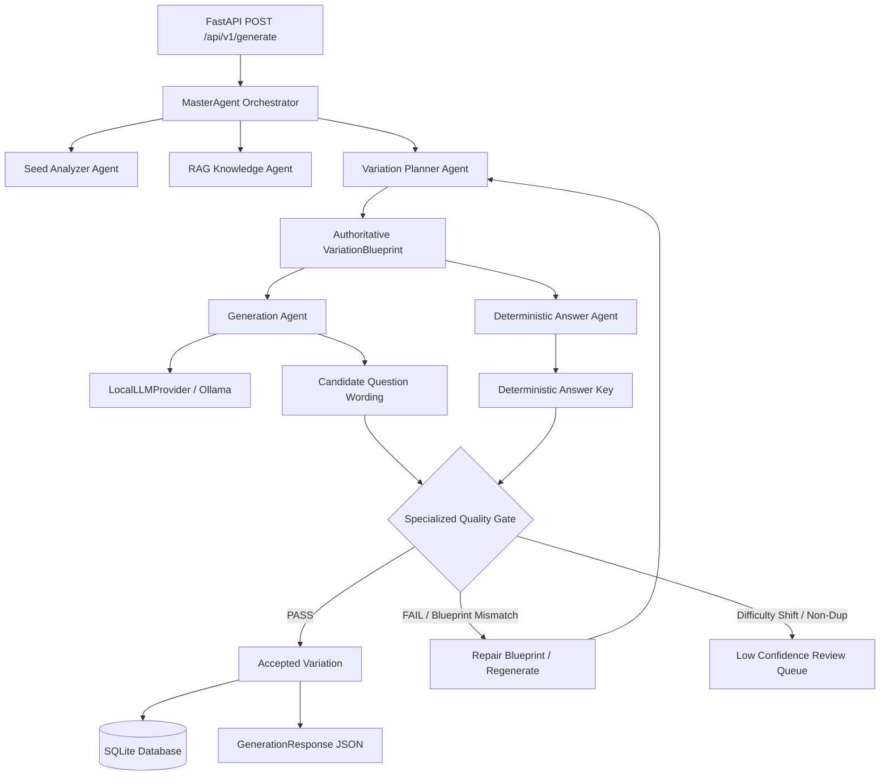

# AMIGO Architecture Overview & Design System

## 1. System Overview
**AMIGO** (*Assignment Question Iteration & Variation Generation System*) is a decoupled, agentic backend system built for **AMYPO National Hackathon 2026 Problem Statement 8 (PS8)**.

The system accepts a seed question, a user-selected domain, and a requested variation count \(N\). It generates \(N\) distinct, pedagogically equivalent question variations while preserving the learning objective, difficulty level, and underlying mathematical formula. Every generated variation includes an automatically generated, deterministic answer key.

---

## 2. Component Architecture

AMIGO is organized into a modular four-tier architecture:

```
                      ┌─────────────────────────────────┐
                      │        HTTP REST API            │
                      │         (apps/api)              │
                      └────────────────┬────────────────┘
                                       │
                                       ▼
                      ┌─────────────────────────────────┐
                      │    MasterAgent Orchestrator     │
                      │      (apps/orchestrator)        │
                      └────────────────┬────────────────┘
                                       │
       ┌───────────────────────────────┼───────────────────────────────┐
       ▼                               ▼                               ▼
┌──────────────┐               ┌──────────────┐                ┌──────────────┐
│ Seed Analyzer│               │ RAG Context  │                │ Variation    │
│    Agent     │               │    Agent     │                │   Planner    │
└──────┬───────┘               └──────┬───────┘                └──────┬───────┘
       │                              │                               │
       └──────────────────────────────┼───────────────────────────────┘
                                      ▼
                      ┌─────────────────────────────────┐
                      │        Generation Agent         │
                      │        (apps/generator)         │
                      └────────────────┬────────────────┘
                                       │
                                       ▼
                      ┌─────────────────────────────────┐
                      │   Deterministic Answer Agent    │
                      │         (apps/generator)        │
                      └────────────────┬────────────────┘
                                       │
                                       ▼
                      ┌─────────────────────────────────┐
                      │    Evaluation Agents & Gate     │
                      │         (apps/evaluator)        │
                      └─────────────────────────────────┘
```

---

## 3. Agentic Architecture

The logical agentic workflow is orchestrated by `MasterAgent` (`apps/orchestrator/agent.py`). It coordinates specialized agents to enforce strict separation of wording generation from deterministic answer key solving.



### Component Responsibility Breakdown

| Component / Agent | Implementation Location | Processing Type | Core Responsibilities |
| :--- | :--- | :--- | :--- |
| **MasterAgent** | `apps/orchestrator/agent.py` | Python Controller | Coordinates agent trajectory, manages regeneration retries, records fine-tuning data, compiles telemetry. |
| **Seed Analyzer** | `apps/generator/seed_analyzer.py` | Hybrid / Rules | Extracts domain, topic, Bloom level, variables, formulas, and target concepts from seed question. |
| **RAG / Knowledge Agent** | `packages/common/rag.py` | Local Vector Retrieval | Provides domain taxonomies, difficulty rubrics, Bloom definitions, and benchmark patterns. |
| **Variation Planner** | `apps/generator/planner.py` | Rule-based Python | Constructs authoritative `VariationBlueprint` objects specifying strategy, scenario, values, formula, and target variable. |
| **Generation Agent** | `apps/generator/variation.py` | Local LLM (`qwen3:4b`) | Converts authoritative blueprint into natural-language question wording using batch LLM generation. |
| **Answer Agent** | `apps/generator/solver.py`, `answer.py` | Deterministic Solver | Computes exact numerical answer and generates structured step-by-step solution from blueprint variables without LLM prompts. |
| **Objective Validator** | `apps/evaluator/objective_validator.py` | NLP Similarity / Rules | Verifies preservation of core learning objective. |
| **Bloom Validator** | `apps/evaluator/bloom.py` | Keyword Classifier | Verifies cognitive depth remains equivalent to seed question. |
| **Difficulty Validator** | `apps/evaluator/difficulty.py` | Feature Analysis / Equivalence | Analyzes structural/numerical complexity and checks equivalence within tolerance (\(\pm 0.25\)). |
| **Duplicate Detector** | `apps/evaluator/duplicate.py` | Vector Similarity | Calculates embedding cosine similarity against existing variations (\(\le 0.85\)). |
| **Blueprint Consistency Validator** | `apps/evaluator/blueprint_validator.py` | Structural Validation | Ensures numerical values in question text match blueprint and rejects hallucinated concepts. |
| **Specialized Quality Gate** | `apps/evaluator/specialized.py` | Aggregator Gate | Aggregates all evaluator results to issue `ACCEPT`, `REPAIR/REGENERATE`, or `LOW_CONFIDENCE`. |

---

## 4. Runtime Execution Flow

When a client submits `POST /api/v1/generate`:

1. **API Layer (`apps/api/routes.py`)**:
   - Validates request body fields (`seed_question`, `domain`, `count`).
   - Resolves `OrchestratorInterface` via dependency injection (`get_orchestrator`).
2. **MasterAgent (`apps/orchestrator/agent.py`)**:
   - Logs `[MASTER] generation request received`.
   - Clears session vector store index.
   - Embeds seed question text and initializes seed tracking metadata.
3. **Seed Analysis (`apps/generator/seed_analyzer.py`)**:
   - Calls `SeedAnalyzer.analyze_seed()` to extract topic, Bloom cognitive level, formula, and variables.
   - Logs `[SEED] seed question analyzed`.
4. **Knowledge Retrieval (`packages/common/rag.py`)**:
   - Calls `KnowledgeContextProvider.get_context()` to load domain taxonomy, difficulty rubrics, and benchmark patterns.
   - Logs `[RAG] context prepared`.
5. **Variation Planning (`apps/generator/planner.py`)**:
   - Calls `VariationPlanner.plan_variations()` to produce authoritative `VariationBlueprint` objects for needed count.
   - Locks variables, target variable (`velocity`), formula (`v = d / t`), and strategy.
   - Logs `[PLANNER] blueprints created`.
6. **Wording Generation (`apps/generator/variation.py`)**:
   - Constructs prompts from blueprints.
   - Calls `LocalLLMProvider.generate_text_batch()` (single Ollama HTTP request for batch execution).
   - Logs `[GENERATOR] candidate variations generated`.
7. **Deterministic Answer Solving (`apps/generator/solver.py`, `apps/generator/answer.py`)**:
   - `DefaultAnswerSolver.solve_blueprint()` computes exact numerical answer from blueprint variables.
   - `DefaultAnswerKeyGenerator` formats step-by-step solution text.
   - Logs `[ANSWER] deterministic answer keys generated`.
8. **Specialized Evaluation & Quality Gate (`apps/evaluator/specialized.py`)**:
   - Runs `BlueprintQuestionConsistencyValidator`, `LearningObjectiveConsistencyValidator`, `AnswerValidator`, `DifficultyEquivalenceValidator`, `BloomEvaluator`, and `DuplicateDetector`.
   - Logs `[QUALITY] candidate accepted` or `[EVALUATOR] candidate rejected`.
9. **Targeted Regeneration & Low-Confidence Queue**:
   - Rejects candidate if duplicate, formula inconsistent, or parameters mismatched.
   - Triggers `repair_blueprint()` and re-evaluates repaired candidates up to `MAX_REGENERATION_ATTEMPTS`.
   - Routes non-duplicate difficulty shift failures to `ReviewItem` queue.
10. **Persistence & Response (`apps/api/repository.py`)**:
    - Saves generation run, accepted variations, telemetry metrics, and review items into SQLite database (`data/amigo.db`).
    - Appends trajectory to `data/fine_tuning_dataset.jsonl`.
    - Returns `GenerationResponse` JSON to client.

---

## 5. Model & Provider Architecture

```
                          ┌──────────────────────────┐
                          │   LLMProvider Interface  │
                          │(packages/common/providers)│
                          └─────────────┬────────────┘
                                        │
                 ┌──────────────────────┴──────────────────────┐
                 ▼                                             ▼
  ┌─────────────────────────────┐               ┌─────────────────────────────┐
  │      LocalLLMProvider       │               │       MockLLMProvider       │
  │   (Ollama / Qwen3:4b Model) │               │   (Offline Dev / Unit Test) │
  └──────────────┬──────────────┘               └─────────────────────────────┘
                 │
                 ▼
  ┌─────────────────────────────┐
  │  generate_text_batch() API  │
  │ (Single Ollama HTTP Request)│
  └─────────────────────────────┘
```

### Provider Abstraction Principles
- All model interaction passes through `LLMProvider`, `EmbeddingProvider`, and `VectorStore` abstractions.
- No paid cloud LLM APIs are used.
- Local model execution uses Ollama serving open-weight models (`qwen3:4b`).
- Batch generation is handled at the provider level via `generate_text_batch()` to eliminate HTTP connection overhead.

---

## 6. Deterministic Answer Generation Architecture

To ensure 100% mathematical accuracy, answer keys are **never generated by LLMs**.

- `VariationBlueprint` defines exact numerical values (e.g., `distance = 240.0`, `time = 12.0`).
- `DefaultAnswerSolver` executes formula evaluation:
  \[
  v = \frac{d}{t} = \frac{240.0}{12.0} = 20.0 \text{ m/s}
  \]
- `DefaultAnswerKeyGenerator` formats the answer key with structured step-by-step reasoning steps.
- `DefaultAnswerValidator` and `DefaultBlueprintQuestionConsistencyValidator` verify that the calculated answer is present in the final variation text and answer key.

---

## 7. RAG Knowledge Architecture

- **Implementation**: `packages/common/rag.py` (`DefaultKnowledgeContextProvider`, `DefaultRetriever`).
- **Data Stores**: In-memory `MockVectorStore` with cosine similarity search over local embeddings.
- **Role**: Injects domain taxonomy, Bloom definitions, difficulty rubrics, and benchmark problem patterns into variation planning and seed analysis.

---

## 8. Directory & Repository Inventory

```
amigo/
├── apps/
│   ├── api/
│   │   ├── __init__.py          # API package marker
│   │   ├── database.py          # SQLAlchemy SQLite database setup & engine
│   │   ├── dependencies.py      # Dependency container (MasterAgent, LLM provider, repositories)
│   │   ├── main.py              # FastAPI application entry point
│   │   ├── models.py            # SQLAlchemy database tables (GenerationRunDB, VariationDB, ReviewDB)
│   │   ├── repository.py        # GenerationRepository implementation
│   │   └── routes.py            # Official PS8 REST endpoints (/generate, /domains, /health)
│   ├── evaluator/
│   │   ├── __init__.py          # Evaluator package exports
│   │   ├── answer_validator.py  # Answer key correctness validator
│   │   ├── bloom.py             # Bloom taxonomy classifier & evaluator
│   │   ├── blueprint_validator.py # Blueprint consistency & anti-hallucination validator
│   │   ├── difficulty.py        # Structural difficulty analyzer & equivalence validator
│   │   ├── duplicate.py         # Embedding-based near-duplicate detector
│   │   ├── evaluate_golden.py   # Golden dataset evaluation script
│   │   ├── evaluator.py         # Base VariationEvaluator aggregator
│   │   ├── interfaces.py        # Abstract evaluator interfaces
│   │   ├── objective_validator.py # Learning objective consistency validator
│   │   └── specialized.py       # SpecializedQualityGate implementation
│   ├── generator/
│   │   ├── __init__.py          # Generator package exports
│   │   ├── answer.py            # AnswerKeyGenerator implementation
│   │   ├── blueprint.py         # DefaultBlueprintGenerator & physics scenario definitions
│   │   ├── interfaces.py        # Generator abstract interfaces
│   │   ├── objective.py         # LearningObjectiveAnalyzer implementation
│   │   ├── parser.py            # QuestionParser implementation
│   │   ├── planner.py           # DefaultVariationPlanner & repair_blueprint implementation
│   │   ├── seed_analyzer.py     # DefaultSeedAnalyzer implementation
│   │   ├── solver.py            # Deterministic DefaultAnswerSolver implementation
│   │   └── variation.py         # DefaultVariationGenerator (batch LLM integration)
│   └── orchestrator/
│       ├── __init__.py          # Orchestrator package marker
│       ├── agent.py             # MasterAgent implementation & telemetry logger
│       ├── interfaces.py        # OrchestratorInterface definition
│       └── pipeline.py          # Legacy GenerationOrchestrator pipeline wrapper
├── packages/
│   ├── common/
│   │   ├── __init__.py          # Shared common exports
│   │   ├── config.py            # Settings configuration class (pydantic-settings / env vars)
│   │   ├── exceptions.py        # System-wide exception definitions
│   │   ├── rag.py               # Local RAG & KnowledgeContextProvider
│   │   └── providers/
│   │       ├── __init__.py      # Providers package marker
│   │       ├── interfaces.py    # LLMProvider, EmbeddingProvider, VectorStore interfaces
│   │       ├── local_provider.py # LocalLLMProvider (Ollama HTTP batch provider)
│   │       └── mock_provider.py # Deterministic MockLLMProvider & MockEmbeddingProvider
│   └── schemas/
│       ├── __init__.py          # Schemas package marker
│       └── models.py            # Pydantic models (SeedQuestion, GenerationRequest, etc.)
├── tests/
│   ├── __init__.py              # Test suite package marker
│   ├── test_api.py              # FastAPI endpoint tests
│   ├── test_evaluator.py        # Unit tests for evaluators & quality gates
│   ├── test_generator.py        # Unit tests for parser, planner, variation generator, solver
│   ├── test_live_verification.py# Live end-to-end API verification tests
│   ├── test_local_provider.py   # LocalLLMProvider batch & single request unit tests
│   ├── test_orchestrator.py     # Pipeline & orchestrator integration tests
│   ├── test_phase3_agentic.py   # Regression, anti-hallucination & batch diversity tests
│   ├── test_providers.py        # Provider interface unit tests
│   ├── test_schemas.py          # Pydantic schema validation tests
│   └── test_semantic_preservation.py # Objective & formula preservation tests
├── docs/
│   └── architecture.md         # System architecture specification
├── models/
│   └── README.md                # Open-weight local model notes
├── data/
│   ├── golden/
│   │   └── seed_questions.json  # Benchmark golden seed questions
│   ├── phase2_results/
│   │   ├── physics_15_variations.csv
│   │   └── physics_15_variations.json
│   ├── README.md                # Data folder notes
│   ├── amigo.db                 # SQLite production/test database
│   ├── fine_tuning_dataset.jsonl # Trajectory logging dataset for future fine-tuning
│   └── golden_evaluation_report.json # Benchmark evaluation output
├── pyproject.toml               # Python project configuration & pytest settings
├── README.md                    # System README & quickstart guide
└── agent.md                     # Agentic guidelines reference
```

---

## 9. Key Design Principles

1. **Authoritative Blueprint Control**: The planner locks variables, formulas, and objectives; the LLM converts blueprints into natural language without inventing math.
2. **Deterministic Answer Solving**: Computational solvers derive answer keys directly from blueprint variables.
3. **Provider Abstraction**: System supports local open-weight LLMs (Ollama) and offline mock providers seamlessly via common interfaces.
4. **Validation Before Acceptance**: Every variation passes through multi-layer evaluators (objective, Bloom, difficulty, duplicate, blueprint consistency).
5. **No External Paid APIs**: Operates 100% locally with open-weight models and local vector indexing.
